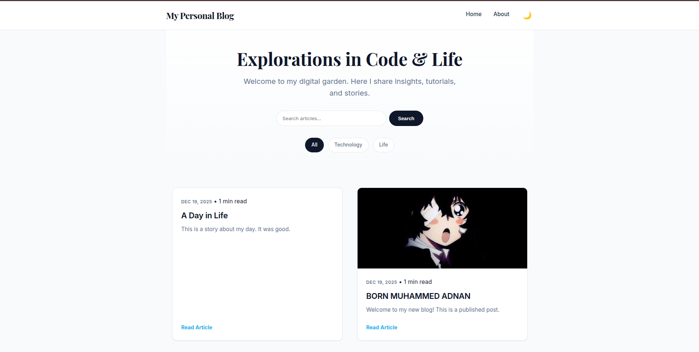
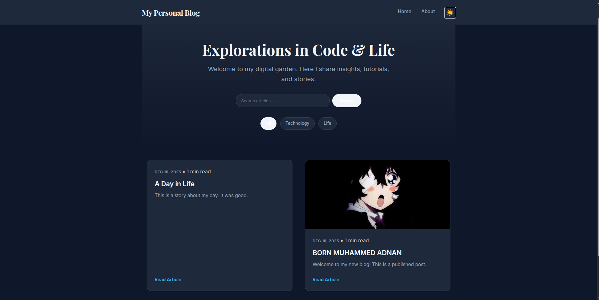
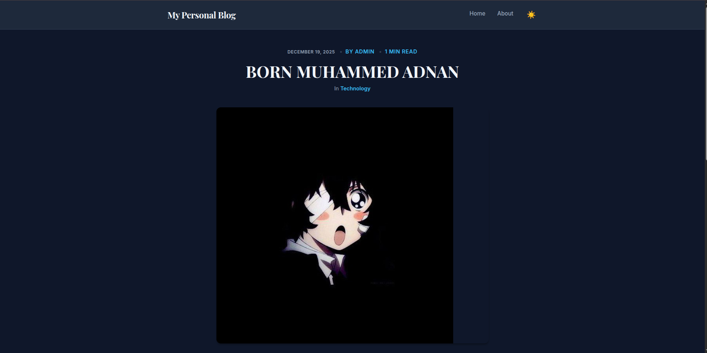
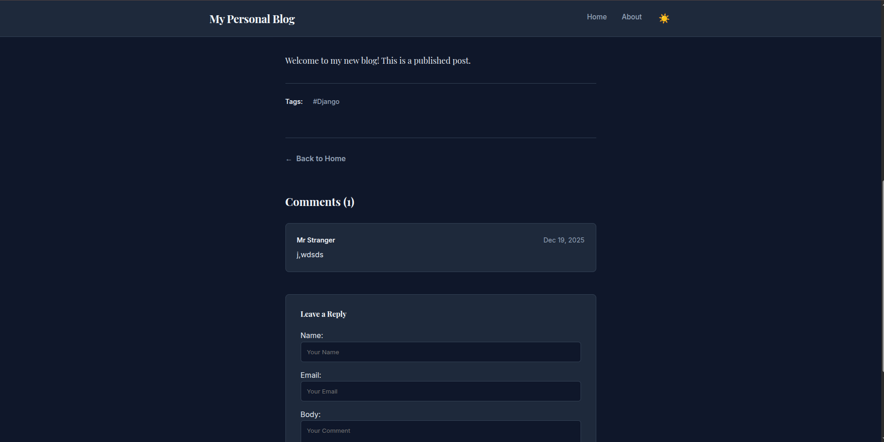

# Premium Personal Blog

<p align="center">
  
  
</p>

### Reading Experience
<p align="center">
  
  
</p>

A modern, responsive, and feature-rich personal blog built with Django. Designed with a focus on typography, reading experience, and premium aesthetics.

## 🌟 Features

### 🎨 Design & UI
*   **Premium Aesthetic**: Clean "Slate & Sky" color palette using modern CSS variables.
*   **Dark Mode 🌙**: Fully functional dark theme with a persistent toggle (saves to localStorage).
*   **Responsive**: Mobile-first design with a grid layout for posts and a responsive navigation.
*   **Typography**: Optimized for readability using *Inter* (UI) and *Playfair Display* (Headings).

### 🚀 Functionality
*   **Search**: Full-text search for posts and tags.
*   **Organization**: Organize content with **Categories** and **Tags**.
*   **Engagement**: Native **Comments** system (admin-moderated).
*   **Discovery**: "Related Posts" suggestions based on content similarity.
*   **Smart Meta**: Auto-calculated **Reading Time** (e.g., "3 min read").

## 🛠 Tech Stack
*   **Backend**: Django 5.x, Python 3.x
*   **Database**: SQLite (default)
*   **Frontend**: HTML5, Vanilla CSS3 (Custom Design System), JavaScript (minimal, for interactions)
*   **Media**: Pillow (Image handling)

## 📦 Installation

1.  **Clone the repository**
    ```bash
    git clone <repository-url>
    cd 2.\ Personal\ Blog
    ```

2.  **Create a Virtual Environment**
    ```bash
    python3 -m venv venv
    source venv/bin/activate  # On Windows: venv\Scripts\activate
    ```

3.  **Install Dependencies**
    ```bash
    pip install -r requirements.txt
    ```

4.  **Apply Migrations**
    ```bash
    python manage.py migrate
    ```

5.  **Create Superuser** (for Admin access)
    ```bash
    python manage.py createsuperuser
    ```

6.  **Run Server**
    ```bash
    python manage.py runserver
    ```

Access the blog at `http://127.0.0.1:8000/`.

## 📖 Usage

### Admin Panel
Log in at `http://127.0.0.1:8000/admin/` to manage:
*   **Posts**: Create, edit, publish (Rich Text support ready).
*   **Categories & Tags**: Organize your content.
*   **Comments**: Approve or delete user comments.

### Adding Content
1.  Go to Admin > Posts > Add Post.
2.  Fill in the Title, Slug, Content, and select a Featured Image.
3.  Assign a Category and Tags.
4.  Set Status to "Published" to make it visible.

## 📂 Project Structure
```
├── blog/                   # Blog Application
│   ├── models.py           # Database Schemas (Post, Category, Tag, Comment)
│   ├── views.py            # Logic (Search, Filter, Details)
│   ├── forms.py            # Forms (Comments)
│   └── urls.py             # Route definitions
├── config/                 # Project Configuration
├── static/                 # Static Assets
│   └── css/style.css       # Custom Design System
├── templates/              # HTML Templates
│   ├── base.html           # Main Layout
│   ├── home.html           # Listing & Search
│   ├── detail.html         # Article View
│   └── about.html          # Static Page
├── media/                  # User Uploaded Files
└── manage.py
```

## 📝 License
This project is open-source and available for personal or commercial use.
